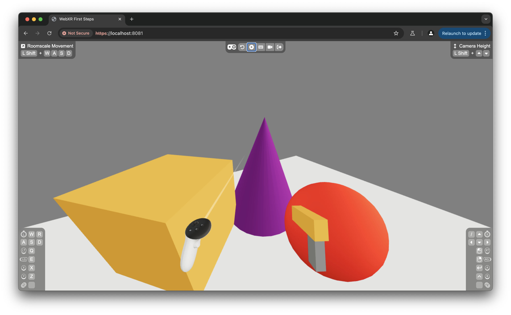

# Chapter 1: Creating Simple Objects in the Scene

Welcome to Chapter 1 of our WebXR tutorial! In this chapter, you’ll learn how to create and position basic objects in a 3D scene using React and Three.js, setting the foundation for our fully immersive VR mini-game.

## React Three Fiber Overview

React is a well-known choice for building websites. React Three Fiber (R3F) extends React’s capabilities beyond 2D websites, enabling developers to create 3D scenes declaratively. Instead of HTML elements, R3F allows us to work directly with Three.js objects, enabling 3D development in React.

### Using React Three XR

In combination with React Three XR, we can add WebXR support to make fully fledged Augmented Reality (AR) or Virtual Reality (VR) experiences (XR refers to AR, VR, and everything in between). In this tutorial, we’ll use R3F and React Three XR to create a fully immersive VR mini-game.

## Exploring the Starting Code in `index.tsx`

To begin the tutorial, switch to the `starting-template` branch. This branch provides a functional WebXR experience with an empty scene, ready for you to build upon:

```bash
git checkout starting-template
```

Let’s take a look at some of the essential parts of our starting code:

1. **`Canvas` Component**: The `Canvas` is where our 3D scene is defined, much like the root `div` element in a standard React application.

```tsx
<Canvas style={{...}}>
  //scene description
</Canvas>
```

2. **`PerspectiveCamera`**: This component sets the position and field of view (fov) for the camera when not in XR, providing a starting view for the scene.

```tsx
<PerspectiveCamera makeDefault position={[0, 1.6, 2]} fov={75} />
```

3. **`Environment`**: The `Environment` component provides ambient lighting for the scene with a preset, simulating a well-lit warehouse.

```tsx
<Environment preset="warehouse" />
```


4. **Floor Mesh**: We define a basic floor mesh using a plane geometry, rotated to serve as the ground.

```tsx
<mesh rotation-x={-Math.PI / 2}>
  <planeGeometry args={[6, 6]} />
  <meshStandardMaterial color="white" />
</mesh>
```

## Task 1: Adding Primitive Shapes

Next, let's add 3D content into the `Canvas` using the concept of a **mesh**. A mesh combines **geometry**, which defines the shape, and **material**, which determines the appearance (like color or texture). Meshes also have properties for setting position and rotation in the scene.

Let’s add a cone, a cube, and a sphere, introducing each new concept along the way.

### 1. Adding a Cone

To add a cone, we specify the shape (geometry) and appearance (material) using Three.js primitives:

```tsx
<mesh position={[0.4, 0.75, -1.5]}>
  <coneGeometry args={[0.6, 1.5]} />
  <meshStandardMaterial color="purple" />
</mesh>
```

- **Geometry**: `coneGeometry` creates a cone shape with parameters (`args`) that define its dimensions. Here, `args={[0.6, 1.5]}` specifies a cone with a base radius of 0.6 units and a height of 1.5 units.
- **Material**: `meshStandardMaterial` gives the cone a purple color with realistic lighting.
- **Position**: The `position` attribute sets the location of the cone in 3D space to `(0.4, 0.75, -1.5)`.

### 2. Adding a Cube

Next, let’s add a cube to the scene. This time, we’ll explore rotation:

```tsx
<mesh position={[-0.8, 0.5, -1.5]} rotation-y={Math.PI / 4}>
  <boxGeometry args={[1, 1, 1]} />
  <meshStandardMaterial color="orange" />
</mesh>
```

- **Geometry**: `boxGeometry` creates a cube, with `args={[1, 1, 1]}` specifying width, height, and depth of 1 unit each.
- **Rotation**: The `rotation-y` property rotates the cube 45 degrees around the Y-axis.
- **Material**: We use an orange color for the cube’s material.
- **Position**: We position the cube at `(-0.8, 0.5, -1.5)`.

### 3. Adding a Sphere

Finally, let’s add a sphere and introduce scaling:

```tsx
<mesh position={[0.6, 0.4, -0.5]} scale={1.2}>
  <sphereGeometry args={[0.4]} />
  <meshStandardMaterial color="red" />
</mesh>
```

- **Geometry**: `sphereGeometry` creates a sphere with a radius of 0.4 units.
- **Scaling**: The `scale` property enlarges the sphere by 20%.
- **Material**: We use a red color for the sphere’s material.
- **Position**: The sphere is positioned at `(0.6, 0.4, -0.5)`.

## VR Features in the Starting Code

The starting code includes VR support using React Three XR. Here’s a breakdown:

1. **`createXRStore`**: This function sets up the `xrStore`, handling everything WebXR-related for our app. It has an `emulate` setting to specify the default positions and orientations of both controllers when using IWER emulation.

2. **`XR` Component**: This component provides the `xrStore` to all components in the scene, giving them access to the current state of the XR session.

3. **Enter VR Button**: We call `xrStore.enterVR()` to launch into the WebXR experience when the user clicks the “Enter VR” button outside the Canvas.

## Task 2: Adding a Custom Gun Model to the Right Controller

To start our target practice experience, let’s add a simple gun model to the right controller. This will override the default controller model, leaving the left controller unchanged.

### Creating `gun.tsx`

Create a new file named `gun.tsx` in the same directory as `index.tsx` to define a basic gun model. The gun model uses the same concepts as before including meshes, geometries, and materials. In addition, we are using a **group**, which allows to group multiple 3D objects together.

```tsx
export const Gun = () => {
  return (
    <group rotation-x={-Math.PI / 8}>
      <mesh>
        <boxGeometry args={[0.035, 0.05, 0.16]} />
        <meshStandardMaterial color="orange" />
      </mesh>
      <mesh rotation-x={Math.PI / 2} position={[0, -0.05, 0.05]}>
        <boxGeometry args={[0.025, 0.04, 0.1]} />
        <meshStandardMaterial color="grey" />
      </mesh>
    </group>
  );
};
```

### Adding the Gun Model to `index.tsx`

To use our new `Gun` model as the right controller, we add it to the `xrStore` like this:

```tsx
controller: {
  right: Gun;
}
```

This overrides the default right controller, displaying the custom gun model instead, while the left controller still shows the default controller model.

## Summary

In this chapter, we’ve introduced React Three Fiber, React Three XR, and explored the setup for adding basic shapes and VR functionality. We now have a functional VR scene, complete with custom controller components, ready to expand with interactivity in the next chapters.

Here’s what our scene looks like now:



[View full changes made in this chapter](https://github.com/meta-quest/webxr-first-steps-react/compare/starting-template...chapter1)
