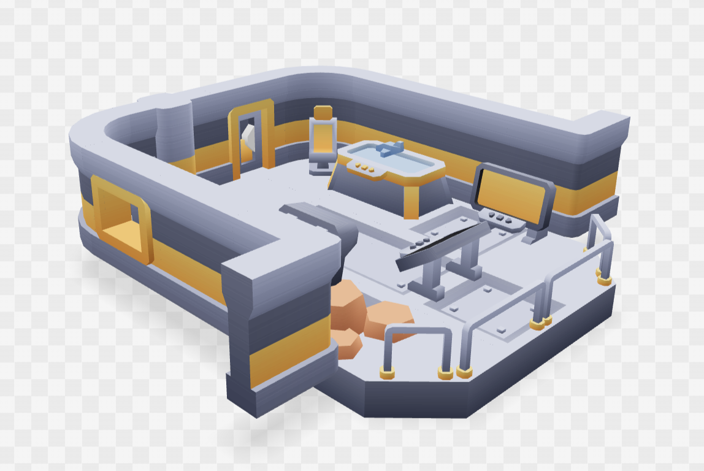
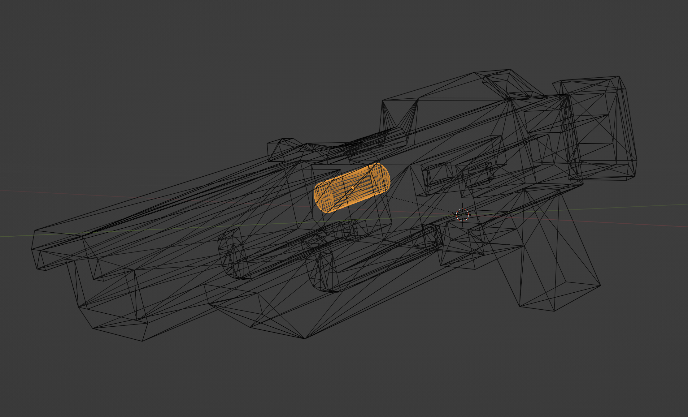
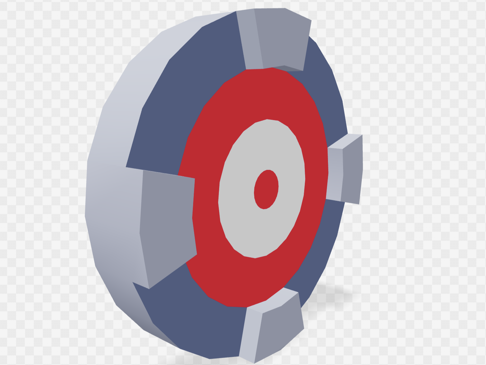
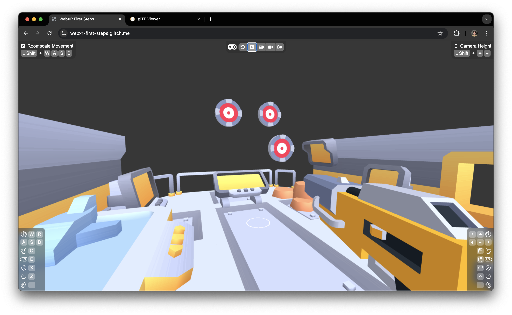

# Chapter 4: Replacing Basic Objects with GLTF Models

In this chapter, we’ll enhance your WebXR experience by replacing basic shapes with detailed GLTF models, adding visual richness and interaction. GLTF models are compact and optimized for web use, making them ideal for our scene.

## 1. Adding the Space Station Model to the Scene

To set up our environment, we’ll replace the default background with a space station model, making it feel more immersive.



Using `@react-three/drei`, it’s simple to load GLTF models with the `<Gltf />` component.

Add this code to `index.tsx` inside the `<Canvas>` component:

```tsx
import { Gltf } from "@react-three/drei";

<Gltf src="assets/spacestation.glb" />;
```

The space station provides an immersive backdrop for your WebXR experience, setting the scene for the interaction to come.


## 2. Adding the Blaster Model to the Gun Component

Now let’s replace the basic geometry of the gun with a 3D blaster model.


We’ll load this model in `gun.tsx` using `useGLTF`, which provides access to the inner structure of the GLTF mesh. This allows us to work with an embedded bullet model in the blaster’s barrel, which we’ll use as the prototype for spawned bullets.

Here’s the updated code for `gun.tsx`:

```tsx
import { Quaternion, Vector3 } from "three";
import {
  useXRControllerButtonEvent,
  useXRInputSourceStateContext,
} from "@react-three/xr";
import React from "react";
import { useBulletStore } from "./bullets";
import { useGLTF } from "@react-three/drei";

export const Gun = () => {
  const state = useXRInputSourceStateContext("controller");
  const { scene } = useGLTF("assets/blaster.glb");
  const bulletPrototype = scene.getObjectByName("bullet")!;

  useXRControllerButtonEvent(state, "xr-standard-trigger", (state) => {
    if (state === "pressed") {
      useBulletStore
        .getState()
        .addBullet(
          bulletPrototype.getWorldPosition(new Vector3()),
          bulletPrototype.getWorldQuaternion(new Quaternion())
        );
    }
  });

  return <primitive object={scene} />;
};

// preload the gun model so that it's ready when the user enters VR
useGLTF.preload("assets/blaster.glb");
```

### Explanation

- **`useGLTF`**: Loads the blaster model and provides access to its internal structure, including the embedded bullet.
- **Preloading**: `useGLTF.preload` ensures the model is ready when we enter VR, reducing load times.
- **Bullet Prototype**: We reference the embedded bullet as a prototype, making it easy to set position and orientation when spawning new bullets.



## 3. Using the Embedded Bullet for Rendering in `bullets.tsx`

Next, we’ll update `bullets.tsx` to render bullets using the embedded bullet model’s geometry and material.

### Modifying the `Bullet` Component

We’ll get the `bulletPrototype` in `Bullet`, allowing each bullet to inherit its geometry and material.

```tsx
import { useGLTF } from "@react-three/drei";

type BulletProps = {
  bulletData: BulletData;
};

const Bullet = ({ bulletData }: BulletProps) => {
  const { scene } = useGLTF("assets/blaster.glb");
  const bulletPrototype = scene.getObjectByName("bullet")! as Mesh;
  const ref = React.useRef<Mesh>(null);
  useFrame(() => {
    const now = performance.now();
    const bulletObject = ref.current!;
    const directionVector = forwardVector
      .clone()
      .applyQuaternion(bulletObject.quaternion);
    bulletObject.position.addVectors(
      bulletData.initPosition,
      directionVector.multiplyScalar(
        (bulletSpeed * (now - bulletData.timestamp)) / 1000
      )
    );
  });

  return (
    <mesh
      ref={ref}
      geometry={bulletPrototype.geometry}
      material={bulletPrototype.material}
      quaternion={bulletData.initQuaternion.toArray()}
    ></mesh>
  );
};
```

By referencing `bulletPrototype` in both the `Gun` and `Bullet` components, we achieve consistent bullet appearance and avoid duplicate model loading.

## 4. Loading and Adding Targets to the Scene

We’ll replace the basic shapes used for targets with detailed GLTF models, adding three target objects to the scene. These targets will later move around when hit, creating a more interactive environment.



### Creating the Target Store

Since we’ll need access to each target for tracking and interactions, we’ll simply store them in an array and export it for usage elsewhere.

Let's create a `targets.tsx` file and define the `targets`:

```tsx
import { Object3D } from "three";
export const targets = new Set<Object3D>();
```

### Rendering the Targets

With the `TargetStore` in place, we’ll load the target model and position three targets at random points. Each target is cloned, added to the store, and rendered with random initial positions.

```tsx
import React from "react";
import { useGLTF } from "@react-three/drei";

type TargetProps = {
  targetIdx: number;
};

export const Target = ({ targetIdx }: TargetProps) => {
  const { scene } = useGLTF("assets/target.glb");
  const target = scene.clone();

  React.useEffect(() => {
    target.position.set(
      Math.random() * 10 - 5,
      targetIdx * 2 + 1,
      -Math.random() * 5 - 5
    );
    targets.add(target);
  }, []);
  return <primitive object={target} />;
};
```

Finally, add these targets to the `<Canvas>` in `index.tsx`:

```tsx
<Target targetIdx={0} />
<Target targetIdx={1} />
<Target targetIdx={2} />
```

## Summary

In this chapter, you’ve replaced basic shapes with detailed GLTF models, including a space station for the environment, a blaster for shooting, and targets for interaction. The blaster model’s embedded bullet prototype gives bullets a consistent appearance and simplifies their spawning, while the targets add dynamic elements for the user to aim at. In the next chapters, we’ll further enhance these interactions and add gameplay elements to make it fun!

Here’s what the scene looks like with the new models:



[View full changes made in this chapter](https://github.com/meta-quest/webxr-first-steps-react/compare/chapter3...chapter4)
